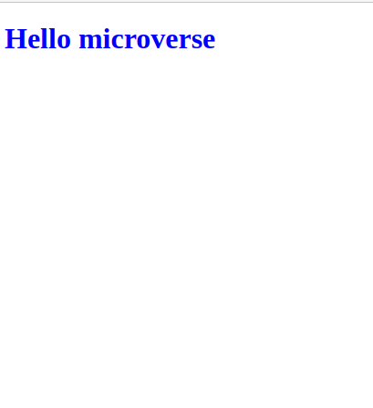

# HELLO WORLD WEBSITE

`This project was the first one in my Microverse journey. I had to set up a "Hello world" repository. The goal was to combine all the tools and best practices I just learned into a repo: Github Workflows, Linters, Documenting my repo professionally With a perfect README.`

Additional description about the project and its features.

## Built With

- Html
- Css
- Linters
- Markdown

## Getting Started

To set up locally on your machine `Git pull` then open the file on your browser.

👤 **Author1**

- GitHub: [@githubhandle](https://github.com/gabrielcoder247)
- LinkedIn: [LinkedIn](https://www.linkedin.com/in/gabriel-nwachukwu-209613173/)

## 🤝 Contributing

Contributions, issues, and feature requests are welcome!

## Show your support

Give a ⭐️ if you like this project!

## 📝 License

This project is [MIT](./MIT.md) licensed.
